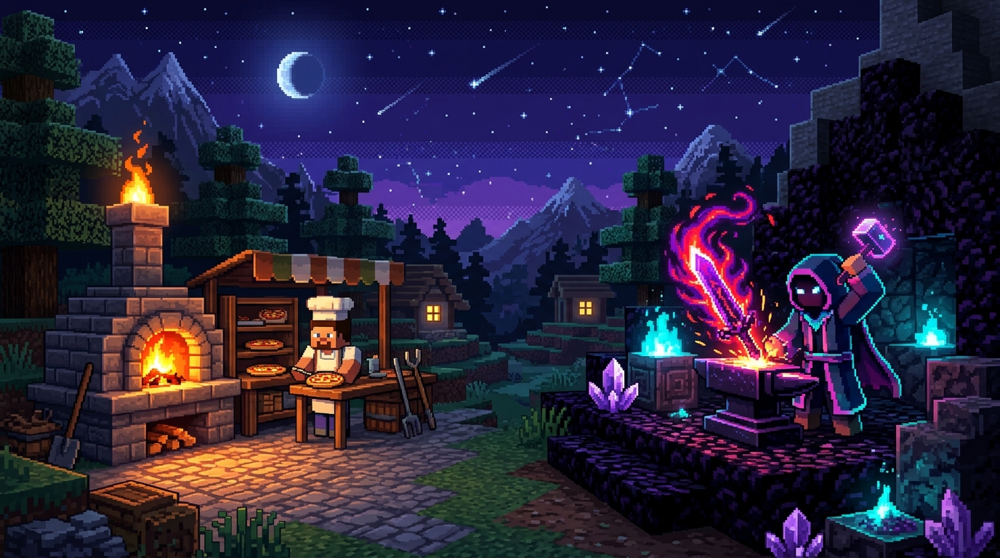

<div align="center">



<br/>

# ⚔️ 𝕎𝕖𝕝𝕔𝕠𝕞𝕖 𝕥𝕠 𝔸𝕝𝕠𝕘𝕖𝕣𝕗'𝕤 𝔻𝕠𝕞𝕒𝕚𝕟 ⚔️

<p align="center">
  
</p>

<p align="center">
  
  
  
</p>

---

### 🎮 ｢ PLAYER HUD & ATTRIBUTES ｣ 🎮

```text
┌──────────────────────────────────────────────────────────────┐
│  PLAYER     : Alogerf                                        │
│  CLASS      : Culinary Artificer (Pizzaiolo & Mod Developer) │
│  ENGINE     : Minecraft Forge (1.20.1)                       │
│  STAMINA    : [████████████████████] 100% (Forno a Lenha)    │
│  FOCUS      : [████████████████████] 100% (Java & Modding)   │
│  MAIN QUEST : Criando os melhores mods e as melhores massas │
└──────────────────────────────────────────────────────────────┘
```

---

### 🏆 ｢ CONQUISTAS DESBLOQUEADAS ｣ 🏆

| Ícone | Conquista | Descrição |
| :---: | :--- | :--- |
| 🍕 | **Forno a Lenha Lendário** | Especialista na arte culinária italiana, dominando massas, fermentação e forno quente. |
| ⛏️ | **Forge Sorcerer** | Desenvolvimento avançado de mods, entidades personalizadas, eventos e dimensões no Forge 1.20.1. |
| ⚡ | **Manipulador de Sistemas** | Criação de GUIs fluidas, pacotes de rede (packets) e lógica complexa de gameplay em Java. |
| 🎮 | **Pixel Artisan** | Ambientação visual imersiva com animações, efeitos e design temático retro/voxel. |

---

### 🛠️ ｢ ARSENAL DE HABILIDADES ｣ 🛠️

<p align="center">
  
  
  
  
  
</p>

---

### 📊 ｢ ESTATÍSTICAS DO SERVIDOR ｣ 📊

<p align="center">
  
  
</p>

<p align="center">
  
</p>

---

<p align="center">
  <i>"A paciência para uma pizza perfeita é a mesma necessária para compilar código sem erros." 🍕✨</i>
</p>

</div>
